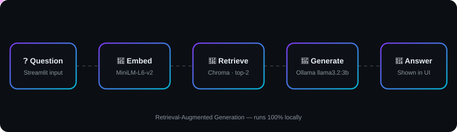
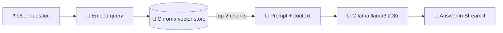

<div align="center">


<a href="https://git.io/typing-svg"></a>

<br/>


</div>

---

## 🎞️ Demo

<div align="center">
  
  <p><i>Question: "who directed the dark knight" → <b>The Dark Knight was directed by Christopher Nolan.</b></i></p>
</div>

## ✨ Features

- 🎬 Ask natural-language questions about movies in `movies.txt`
- 🔎 Semantic search with **ChromaDB** + `all-MiniLM-L6-v2` embeddings
- 🦙 Answers generated locally by **Ollama** (`llama3.2:3b`)
- 🛡️ Anti-hallucination prompt: replies _"I don't know"_ if the context lacks the answer
- ⚡ Vector store cached with `@st.cache_resource` so it builds only once per session

## 🧠 How It Works

<div align="center">
  
</div>



1. `rag.py` loads `movies.txt`, splits it into 500-character chunks (50 overlap) and embeds them into Chroma.
2. On each question, the **2 most similar chunks** are retrieved as context.
3. `app.py` wraps context + question in a strict prompt and sends it to Ollama via `ollama_client.py`.
4. The answer is displayed in the UI.

## 📁 Project Structure

```text
MOVIE KNOWLEDGE ASSISTANT/
├── app.py              # Streamlit UI + prompt building
├── rag.py              # Loading, chunking, embeddings, Chroma, retrieval
├── ollama_client.py    # Calls the local Ollama REST API
├── movies.txt          # Movie knowledge base
├── requirements.txt    # Python dependencies
└── assets/             # README images (demo screenshot, animated pipeline)
```

## 🚀 Getting Started

### 1. Install Ollama and pull the model

```bash
ollama pull llama3.2:3b
ollama serve          # listens on http://localhost:11434
```

### 2. Install dependencies

```bash
python -m venv venv
venv\Scripts\activate        # Windows
# source venv/bin/activate   # macOS / Linux
pip install -r requirements.txt
```

### 3. Run the app

```bash
streamlit run app.py
```

Open the URL shown in the terminal (usually http://localhost:8501).

## 💬 Try These Questions

| Question                       | Expected answer                                      |
| ------------------------------ | ---------------------------------------------------- |
| Who directed Inception?        | Christopher Nolan                                    |
| Who stars in Interstellar?     | Matthew McConaughey, Anne Hathaway, Jessica Chastain |
| What is The Dark Knight about? | Batman faces the Joker in Gotham City                |
| Which movie came out in 2014?  | Interstellar                                         |

## ➕ Adding More Movies

Append entries to `movies.txt` using the same format, then restart the app:

```text
Movie: Title
Genre: ...
Director: ...
Year: ...
Cast: ...
Plot: ...
```

## ⚙️ Configuration

| Setting                | File                              | Default                                  |
| ---------------------- | --------------------------------- | ---------------------------------------- |
| Ollama model           | `ollama_client.py` → `MODEL`      | `llama3.2:3b`                            |
| Ollama URL             | `ollama_client.py` → `OLLAMA_URL` | `http://localhost:11434/api/generate`    |
| Chunk size / overlap   | `rag.py`                          | `500` / `50`                             |
| Retrieved chunks (`k`) | `rag.py` → `retrieve_answer`      | `2`                                      |
| Embedding model        | `rag.py`                          | `sentence-transformers/all-MiniLM-L6-v2` |

## 🛠️ Troubleshooting

- **Connection refused on port 11434** → make sure `ollama serve` is running.
- **Model not found** → run `ollama pull llama3.2:3b`.
- **Slow first start** → the embedding model downloads once from Hugging Face.

---

<div align="center">

Made with ❤️ and 🍿 by **Vanamala Jayasurya**


</div>
